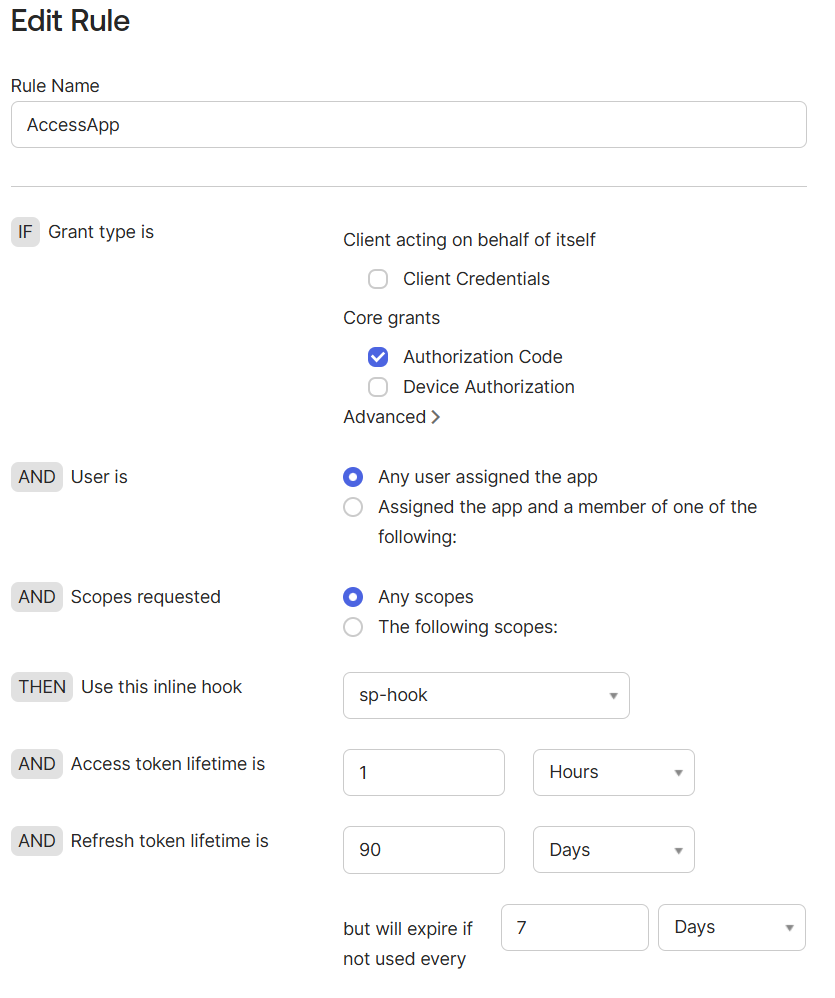

Sometimes you need to extend the default behavior of Okta during authentication, particularly when issuing OAuth 2.0 or OpenID Connect tokens.

Okta provides **Inline Hooks**, which allow you to invoke an external service at specific points in an authentication flow and dynamically modify the outcome.

This article demonstrates how to use a **Token Inline Hook** to add a custom claim to an ID Token. In the below flow sequence, the request is originated from a a Spring Boot application acting as an OIDC client.

```
Spring Boot Client
        │
        ▼
      Okta
        │
        ▼
Token Inline Hook
        │
        ▼
 Node.js (Express)
        │
        ▼
Returns commands
        │
        ▼
Okta issues ID Token
(with custom claim)
```

> **Note:** Token Inline Hooks are supported only with **Custom Authorization Servers**.

Inline Hooks are:

- Synchronous (executed during authentication)
- Hosted externally
- Latency-sensitive, so your endpoint should respond quickly

---

# Implementation Requirements

You'll need the following:

- An Okta OIDC application
- A client application (Spring Boot in this example)
- A publicly accessible HTTPS endpoint
- A Token Inline Hook
- A Custom Authorization Server

---

# Step 1 – Create an OIDC Application

Navigate to:

```
Applications → Applications → Create App Integration → OIDC
```

Choose **Web Application** and configure:

- Redirect URI
- Client ID
- Client Secret

In this article, a Spring Boot OAuth 2.0 client is used.

> Ensure the issuer matches your Custom Authorization Server.

Example:

```text
https://your-okta-domain/oauth2/default
```

---

# Step 2 – Create a Public Endpoint

Since Okta invokes your endpoint, it must be publicly accessible.

For local development, **ngrok** is a convenient option.

Install ngrok:

```bash
choco install ngrok
```

Authenticate ngrok:

```bash
ngrok config add-authtoken YOUR_TOKEN_HERE
```

---

# Step 3 – Implement the Inline Hook

The following Node.js application uses Express.

```javascript
const express = require('express');

const app = express();

app.use(express.json());

app.post('/okta-hook', (req, res) => {

  const authHeader = req.headers['authorization'];

  if (authHeader !== 'my-secret') {
    return res.status(401).json({ error: 'Unauthorized' });
  }

  console.log(JSON.stringify(req.body, null, 2));

  res.json({
    commands: [
      {
        type: "com.okta.identity.patch",
        value: [
          {
            op: "add",
            path: "/claims/custom-claim",
            value: "hello-from-hook"
          }
        ]
      }
    ]
  });
});

app.listen(3000);
```

The hook does **not** modify the token directly.

Instead, it returns a set of commands that Okta executes before issuing the token.

In this example, the `com.okta.identity.patch` command instructs Okta to add a new claim named `custom-claim`.

---

## Run the application

```bash
node app.js
```

Expose it using ngrok.

```bash
ngrok http 3000
```

Example:

```text
https://xyz123.ngrok-free.app
```

Configure the hook URL as:

```text
https://xyz123.ngrok-free.app/okta-hook
```

---

# Step 4 – Configure the Token Inline Hook

Navigate to:

```
Workflow → Inline Hooks → Token
```

Configure:

- Name
- URL
- Authentication Type: Header
- Header Value: `my-secret`

The configured secret should match the value expected by your Node.js application.

---

# Step 5 – Create a Custom Authorization Server

Navigate to:

```
Security → API → Authorization Servers
```

Create a new Authorization Server if required.

Example issuer:

```text
https://your-okta-domain/oauth2/default
```

---

# Step 6 – Configure an Access Policy

This step is essential.

Without an Access Policy, the Inline Hook will never execute.

Create a policy that:

- Applies to your OIDC application
- Uses the Authorization Code grant
- Includes the required scopes
- References your Token Inline Hook

<!-- IMAGE PLACEHOLDER: Grafana log view filtered by Keycloak instance.Diagram -->



> **Screenshot:** Access Policy Rule with Token Inline Hook selected.

---

# Step 7 – Test

1. Start the Node.js application.
2. Start ngrok.
3. Run your client application.
4. Authenticate through Okta.

During authentication:

- Okta invokes the Inline Hook.
- The Node.js service returns the patch command.
- Okta adds the custom claim.
- The ID Token is issued.

Expected claim:

```json
{
  "custom-claim": "hello-from-hook"
}
```

---

# Verification

You can verify the implementation by:

- Decoding the token using **jwt.io**
- Viewing Inline Hook Metrics in the Okta Admin Console

---

# Best Practices

- Use Token Inline Hooks only when dynamic processing is required.
- Keep the external service lightweight and responsive.
- Protect the endpoint using appropriate authentication.
- Minimize latency because the hook executes synchronously.
- Handle failures gracefully.

---

# Summary

Token Inline Hooks provide a flexible mechanism for enriching OAuth 2.0 and OpenID Connect tokens without modifying the Okta user schema.

Common use cases include:

- Adding custom claims
- Transforming attributes
- Retrieving data from external systems
- Conditional claim injection
- Integrating enterprise applications during authentication

They provide an elegant way to extend token generation while keeping identity data centralized and your applications loosely coupled.