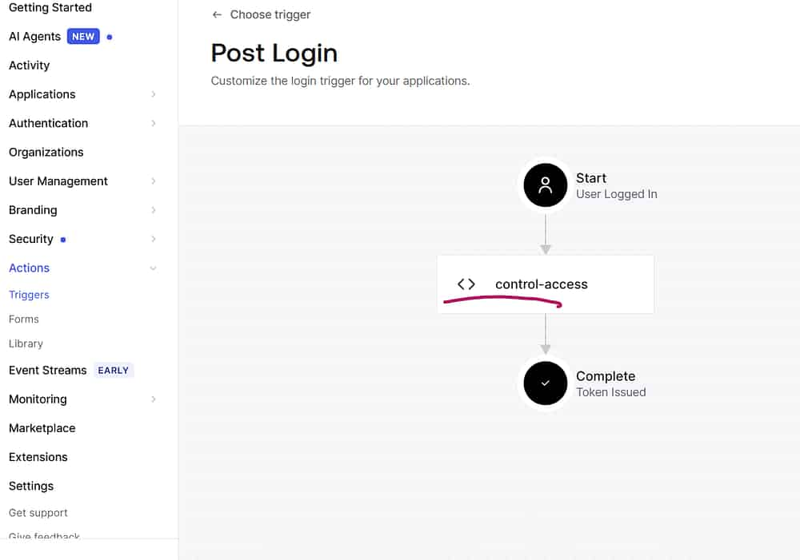

## Introduction

In a [previous](https://blog.encourageat.com/customizing-auth0-with-actions-and-triggers/) article, we explored how to customize Auth0 using **Actions** and **Triggers**. If you're new to these concepts, I recommend reading that article first.

In this article, we'll take the next step by automating Auth0 configurations using **Terraform**. Instead of making manual changes through the Auth0 Dashboard, we'll manage our identity infrastructure as code, making it reproducible, version-controlled, and CI/CD-friendly.

If you're new to the Auth0 Terraform Provider, I also recommend reviewing my [introductory article](https://blog.encourageat.com/getting-started-with-auth0-automation-using-terraform) on configuring Auth0 with Terraform before continuing.

---

## Overview

In this article, we will:

- Automate Auth0 Actions and Triggers using Terraform
- Restrict access to a client application (`custom-client`) during weekends
- Deploy the configuration as Infrastructure as Code (IaC)

---

## Why Use Terraform for Auth0?

Using the Auth0 Terraform Provider offers several advantages:

- Eliminate manual configuration errors
- Enable CI/CD deployment pipelines
- Version-control IAM configurations
- Create repeatable environments (Development, QA, Production)
- Simplify infrastructure management

---

## Prerequisites

### 1. Machine-to-Machine (M2M) Application

Create a **Machine-to-Machine (M2M)** application in Auth0.

Authorize it to access the **Auth0 Management API** and assign the required permissions (following the principle of least privilege for production environments).

Make a note of:

- Auth0 Domain
- Client ID
- Client Secret

> For more details, refer to the overview section of my Auth0 Terraform Provider article.

---

### 2. Client Application

Create the client application that will be protected by the Action.

In this example, the client application is named:

```
custom-client
```

---

## Project Structure

```text
auth0-terraform/
│
├── main.tf
├── providers.tf
├── variables.tf
└── actions/
    └── control-access.js
```

---

# Step 1 – Configure the Terraform Provider

**providers.tf**

```terraform
terraform {
  required_providers {
    auth0 = {
      source  = "auth0/auth0"
      version = "~> 1.0"
    }
  }
}

provider "auth0" {
  domain        = var.auth0_domain
  client_id     = var.auth0_client_id
  client_secret = var.auth0_client_secret
}
```

---

# Step 2 – Define Variables

**variables.tf**

```terraform
variable "auth0_domain" {}

variable "auth0_client_id" {}

variable "auth0_client_secret" {
  sensitive = true
}
```

---

# Step 3 – Set Terraform Variables

Copy the values from your registered Machine-to-Machine application.

```bash
export TF_VAR_auth0_domain="your-auth0-domain"

export TF_VAR_auth0_client_id="your-auth0-client-id"

export TF_VAR_auth0_client_secret="your-auth0-client-secret"
```

> Windows PowerShell users can use `$env:TF_VAR_auth0_domain=...` instead of `export`.

---

# Step 4 – Create the Action and Attach It to the Trigger

## Terraform Configuration

**main.tf**

```terraform
resource "auth0_action" "custom_action" {

  name    = "control-access"
  runtime = "node18"

  code = file("${path.module}/actions/control-access.js")

  deploy = true

  supported_triggers {
    id      = "post-login"
    version = "v3"
  }
}

resource "auth0_trigger_actions" "login_flow" {

  trigger = "post-login"

  actions {
    id           = auth0_action.custom_action.id
    display_name = auth0_action.custom_action.name
  }

}
```

---

## Action Code

**actions/control-access.js**

```javascript
exports.onExecutePostLogin = async (event, api) => {

  if (event.client.name === "custom-client") {

    const d = new Date().getDay();

    // 0 = Sunday
    // 6 = Saturday

    if (d === 0 || d === 6) {
      api.access.deny("This app is only available during weekdays");
    }
  }

};
```

The Action checks whether the user is logging into the **custom-client** application.

If the login occurs on **Saturday or Sunday**, access is denied before tokens are issued.

---

# Step 5 – Deploy the Configuration

Run the following Terraform commands:

```bash
terraform init

terraform plan

terraform apply
```

After successful deployment:

- The Action is created
- The Action is deployed
- The Action is attached to the **Post Login** trigger

<!-- IMAGE PLACEHOLDER: -->
  

---

## Verification

Launch the **custom-client** application.

Expected behavior:

- **Monday–Friday:** Login succeeds
- **Saturday–Sunday:** Login is denied with the configured message

You can also verify execution from:

**Auth0 Dashboard → Monitoring → Logs**

---

## Best Practices

- Keep Action source code under version control.
- Avoid storing secrets inside Terraform files.
- Use Terraform variables or secret-management solutions.
- Grant only the minimum Management API permissions required.
- Promote the same Terraform configuration across Development, QA, and Production environments.

---

# Summary

In this article, we automated Auth0 customization using **Terraform** by provisioning an Action and attaching it to the **Post Login** trigger.

Managing Auth0 configurations as code provides several benefits:

- Consistent deployments
- Repeatable environments
- Easier code reviews
- Better collaboration
- Seamless integration with modern DevOps and CI/CD pipelines

Infrastructure as Code is a recommended approach for managing identity platforms at scale, reducing manual effort while improving reliability and maintainability.