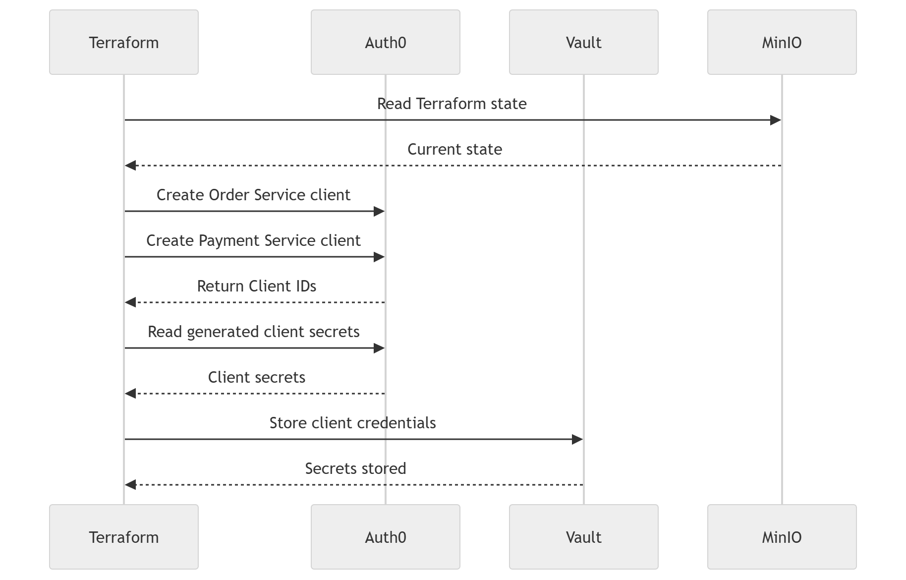

## Introduction

In the [previous article](https://blog.encourageat.com/getting-started-with-auth0-automation-using-terraform/), we introduced the basics of using Terraform to
automate Auth0 configuration. In this article, we'll build a workflow
that more closely resembles an enterprise deployment.

Our goals are to:

-   Create Auth0 OIDC clients using Terraform.
-   Store Terraform state in an S3-compatible backend (MinIO).
-   Store generated Auth0 client credentials securely in HashiCorp
    Vault.
-   Run everything locally while following patterns that can later be
    migrated to production with minimal changes.

## High-Level Architecture

``` text
                GitHub Actions (Production)
                        │
        GitHub Secrets / CI Variables
                        │
                        ▼
                  Terraform Apply
                 /                 \
        Auth0 Provider        Vault Provider
               │                    ▲
               ▼                    │
        Create OIDC Clients         │
               │                    │
               └──── Store Client Credentials ───► Vault

          Terraform State ─────────► MinIO (S3 Backend)
```

## Sequence Diagram



## Why MinIO?

MinIO provides an S3-compatible object store that lets us simulate an
AWS S3 backend locally. This enables us to practice using a remote
Terraform backend without requiring an AWS account.

## Why HashiCorp Vault?

Applications should never embed secrets inside source code or
configuration files.

Instead, Terraform creates the Auth0 clients, retrieves the generated
client secrets, and stores them securely in Vault. Applications can
later retrieve those secrets during startup.

## Project Structure

``` text
terraform-auth0-vault/
├── auth0.tf
├── vault.tf
├── providers.tf
├── variables.tf
├── outputs.tf
├── backend.tf
├── dev.tfvars
├── docker-compose.yml
├── .gitignore
└── README.md
```

## Implementation Dependencies

1.  Auth0 Machine-to-Machine application with Management API
    permissions.
2.  Docker Desktop.
3.  Terraform.
4.  HashiCorp Vault.
5.  Vault CLI.
6.  MinIO.

## Auth0 Machine-to-Machine application with Management API permissions.

The **Getting Started with Auth0 Automation Using Terraform** blog, refrenced in the introductory session of this blog have details on creating Machine-to-Machine application with Management API permissions. So I am not repeating the same in this blog. Make sure to follow the **Principle of Least Privilege** by assigning only the permissions required. 

## Docker Compose

Use the docker-compose.yml shown below to start Vault and MinIO. 

```
version: "3.9"

services:

  vault:
    image: hashicorp/vault:latest
    container_name: vault
    restart: unless-stopped

    ports:
      - "8200:8200"

    cap_add:
      - IPC_LOCK

    environment:
      VAULT_DEV_ROOT_TOKEN_ID: myroot
      VAULT_DEV_LISTEN_ADDRESS: "0.0.0.0:8200"

    command: vault server -dev

    volumes:
      - vault-data:/vault/data

  minio:
    image: minio/minio
    container_name: minio
    restart: unless-stopped

    command: server /data --console-address ":9001"

    ports:
      - "9000:9000"
      - "9001:9001"

    environment:
      MINIO_ROOT_USER: admin
      MINIO_ROOT_PASSWORD: password123

    volumes:
      - ./minio-data:/data

volumes:
  vault-data:
```

> In production environments do not hard code the password like above.

Start the containers:

``` bash
docker compose up -d
docker ps
```

## Providers

### providers.tf

``` hcl
provider "auth0" {
  domain        = var.auth0_domain
  client_id     = var.auth0_client_id
  client_secret = var.auth0_client_secret
}

provider "vault" {
  address = var.vault_addr
  token   = var.vault_token
}
```

## variables.tf

``` hcl
variable "auth0_domain" {}

variable "auth0_client_id" {}

variable "auth0_client_secret" {
  sensitive = true
}

variable "vault_addr" {
  type = string
}

variable "vault_token" {
  type      = string
  sensitive = true
}
```

## dev.tfvars

> Do **not** commit this file to Git.

``` hcl
auth0_domain        = "dev-xxxx.us.auth0.com"
auth0_client_id     = "xxxxxxxxxxxxxxxx"
auth0_client_secret = "yyyyyyyyyyyyyyyy"

vault_addr  = "http://127.0.0.1:8200"
vault_token = "myroot"
```

Add the following to `.gitignore`:

``` text
dev.tfvars
terraform.tfvars
*.auto.tfvars
terraform.tfstate*
```

## Auth0 Resources

Terraform creates two OIDC applications:

-   Order Service
-   Payment Service

## auth0.tf

```
resource "auth0_client" "order_service" {

  name            = "Order Service"

  description     = "OrderService client created through Terraform"

  app_type        = "regular_web"

  callbacks       = [
    
    "http://localhost:9090/login/oauth2/code/auth0"
  ]

  oidc_conformant = true

  jwt_configuration {

    alg = "RS256"

  }

}


resource "auth0_client" "payment_service" {

  name            = "Payment Service"

  description     = "PaymentService client created through Terraform"

  app_type        = "regular_web"

  callbacks       = [
    "http://localhost:3000/callback"
  ]

  oidc_conformant = true

  jwt_configuration {

    alg = "RS256"

  }

}
```

## Retrieving Client Secrets

Terraform first creates the Auth0 clients.

Next, it uses the Auth0 data source to retrieve the generated client
secrets.

Finally, it stores the client ID and client secret in Vault.

## vault.tf

```
data "auth0_client" "order_service" {
  client_id = auth0_client.order_service.client_id
}

data "auth0_client" "payment_service" {
  client_id = auth0_client.payment_service.client_id
}

resource "vault_kv_secret_v2" "order_secret" {

  mount = "secret"

  name = "auth0/order-service"

  data_json = jsonencode({

      client_id     = auth0_client.order_service.client_id

      client_secret = data.auth0_client.order_service.client_secret

  })

}

resource "vault_kv_secret_v2" "payment_secret" {

  mount = "secret"

  name = "auth0/payment-service"

  data_json = jsonencode({

      client_id     = auth0_client.payment_service.client_id

      client_secret = data.auth0_client.payment_service.client_secret

  })

}
```

## Outputs

Define outputs to display the generated client IDs and Vault paths.

## outputs.tf

```
output "order_service_client_id" {
  description = "OIDC Client ID for Order Service"
  value       = auth0_client.order_service.client_id
}

output "payment_service_client_id" {
  description = "OIDC Client ID for Payment Service"
  value       = auth0_client.payment_service.client_id
}

output "order_service_vault_path" {
  description = "Vault path for Order Service credentials"
  value       = "secret/auth0/order-service"
}

output "payment_service_vault_path" {
  description = "Vault path for Payment Service credentials"
  value       = "secret/auth0/payment-service"
}
```

Run:

``` bash
terraform init
terraform plan -var-file=dev.tfvars
terraform apply -var-file=dev.tfvars
```

Verify Vault:

``` bash
vault kv list secret/auth0
vault kv get secret/auth0/order-service
vault kv get secret/auth0/payment-service
```

## Remote Backend using MinIO

Terraform maintains a **terraform.tfstate** file that represents the
current infrastructure state.

In production this file should not remain on a developer workstation.
Instead, it should be stored in a remote backend such as AWS S3.

For local development we use MinIO, an S3-compatible object store.

Create a bucket named **terraform-state** and configure `backend.tf`

## backend.tf

```
terraform {

  backend "s3" {

    bucket = "terraform-state"
    key    = "auth0-demo/terraform.tfstate"
    region = "us-east-1"

    endpoints = {
      s3 = "http://localhost:9000"
    }

    access_key = "admin"
    secret_key = "password123"

    skip_credentials_validation = true
    skip_metadata_api_check     = true
    skip_region_validation      = true
    skip_requesting_account_id  = true
    skip_s3_checksum            = true

    use_path_style = true
  }
}
```

Re-run:

``` bash
terraform init
```

Terraform will migrate the state to MinIO.

## Production Considerations

In production:

-   Store Auth0 Management API credentials in GitHub Secrets or another
    secure CI/CD secret store.
-   Store Terraform state in AWS S3 (or equivalent).
-   Use managed HashiCorp Vault or another enterprise secret manager.
-   Authenticate GitHub Actions to Vault using OIDC/JWT instead of
    long-lived tokens.
-   Keep separate environments for Development, Staging and Production.

## Conclusion

This tutorial demonstrated an enterprise-style infrastructure
provisioning workflow using Auth0, Terraform, Vault and MinIO while
running entirely on a local machine.

In a follow-up article, we will build on this foundation by integrating
Kubernetes with HashiCorp Vault so that applications can securely
retrieve Auth0 client credentials at runtime without embedding secrets
in configuration files.
