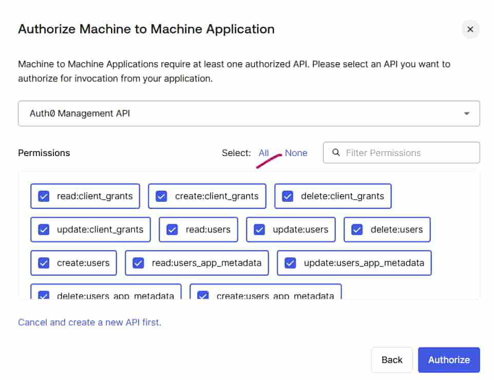

## Introduction

Managing identity infrastructure manually through the Auth0 Dashboard works well for small environments, but it becomes increasingly difficult as applications and environments grow.

Modern DevOps practices emphasize **automation**, **version control**, and **repeatability**. This is where **Infrastructure as Code (IaC)** becomes valuable.

Although Auth0 resources are technically configuration rather than infrastructure, managing them using Terraform is widely considered an Infrastructure as Code practice because the same principles apply—configurations become version-controlled, repeatable, and suitable for CI/CD pipelines.

In this article, we'll learn how to automate Auth0 configuration using the **Auth0 Terraform Provider** by creating an OIDC application.

---

# What is Terraform?

Terraform is an open-source **Infrastructure as Code (IaC)** tool developed by HashiCorp.

It enables you to define, provision, and manage infrastructure and SaaS resources using a declarative language called **HashiCorp Configuration Language (HCL)**.

Using the Auth0 Terraform Provider, many of the configurations normally performed through the Auth0 Dashboard can instead be managed as code through the Auth0 Management API.

This approach provides several benefits:

- Consistent deployments across Development, QA, and Production
- Version-controlled identity configuration
- Reduced manual errors
- Easier collaboration among teams
- Automation through CI/CD pipelines

---

# Overview

Terraform requires permission to manage resources in your Auth0 tenant.

This is achieved by creating a **Machine-to-Machine (M2M)** application that is authorized to access the **Auth0 Management API**.

The overall process is:

1. Create an M2M Application.
2. Authorize it to use the Auth0 Management API.
3. Assign the required Management API permissions.
4. Use its credentials from Terraform.

You'll need the following values:

- Auth0 Domain
- Client ID
- Client Secret


<!-- IMAGE PLACEHOLDER: -->



> For learning purposes, granting broad permissions is acceptable. In production environments, always follow the **Principle of Least Privilege** by assigning only the permissions required.

---

# Implementation

In this example, we'll create a simple **OIDC Regular Web Application** using Terraform.

---

# Step 1 – Configure the Provider

First, configure the Auth0 provider.

**providers.tf**

```terraform
terraform {

  required_providers {

    auth0 = {
      source  = "auth0/auth0"
      version = ">= 1.0.0"
    }

  }

}

provider "auth0" {}
```

---

# Step 2 – Define Variables

**variables.tf**

```terraform
variable "auth0_domain" {}

variable "auth0_client_id" {}

variable "auth0_client_secret" {
  sensitive = true
}
```

---

# Step 3 – Configure Environment Variables

Instead of storing secrets in Terraform files, define them as environment variables.

Linux/macOS

```bash
export TF_VAR_auth0_domain="your-domain"

export TF_VAR_auth0_client_id="your-client-id"

export TF_VAR_auth0_client_secret="your-client-secret"
```

Windows PowerShell

```powershell
$env:TF_VAR_auth0_domain="your-domain"

$env:TF_VAR_auth0_client_id="your-client-id"

$env:TF_VAR_auth0_client_secret="your-client-secret"
```

---

# Step 4 – Initialize Terraform

```bash
terraform init
```

Terraform downloads the Auth0 Provider and prepares the working directory.

---

# Step 5 – Create an OIDC Application

Append the following resource to **main.tf**.

```terraform
resource "auth0_client" "auto_client" {

  name            = "AutoApp"

  description     = "AutoApp created through Terraform"

  app_type        = "regular_web"

  callbacks       = [
    "http://localhost:3000/callback"
  ]

  oidc_conformant = true

  jwt_configuration {

    alg = "RS256"

  }

}
```

---

# Step 6 – Preview the Changes

```bash
terraform plan
```

Terraform compares the desired configuration with the current state of your Auth0 tenant and displays the changes that will be made.

---

# Step 7 – Apply the Configuration

```bash
terraform apply
```

After confirmation, Terraform creates the application in your Auth0 tenant.

You can verify the new **Regular Web Application** from the Auth0 Dashboard.

---

# Understanding Terraform State

Terraform maintains a state file named:

```text
terraform.tfstate
```

This file acts as Terraform's source of truth.

It contains:

- Resource mappings
- Resource metadata
- Current infrastructure state
- Occasionally sensitive values

> Never commit **terraform.tfstate** to Git. In production, use a secure remote backend such as Terraform Cloud, AWS S3, or Azure Storage.

---

# Resource vs Data Source

Terraform distinguishes between two important concepts.

## Resource

A **Resource** creates and manages infrastructure.

Example:

```terraform
resource "auth0_client" ...
```

---

## Data Source

A **Data Source** reads existing infrastructure without creating or modifying it.

Example use cases include:

- Reading an existing connection
- Reading an existing client
- Referencing an existing organization

Data sources are useful when integrating Terraform with pre-existing Auth0 environments.

---

# Detecting Configuration Drift

Suppose someone manually changes the Auth0 application through the Dashboard after it has been created using Terraform.

This situation is known as **configuration drift**.

Run:

```bash
terraform plan
```

Terraform compares:

- Desired state (Terraform configuration)
- Actual state (Auth0 tenant)

and reports any differences.

If you later execute:

```bash
terraform apply
```

Terraform attempts to bring the environment back to the state defined in your configuration.

For this reason, it's considered a best practice to treat Terraform as the **single source of truth** and avoid manual configuration changes.

---

# Using Terraform in CI/CD Pipelines

Terraform is commonly executed from CI/CD platforms such as GitHub Actions.

Sensitive values should never be hardcoded.

Instead, store them securely using:

- GitHub Secrets
- HashiCorp Vault
- AWS Secrets Manager
- Azure Key Vault

Example GitHub Actions configuration:

```yaml
env:
  AUTH0_DOMAIN: ${{ secrets.AUTH0_DOMAIN }}
  AUTH0_CLIENT_ID: ${{ secrets.AUTH0_CLIENT_ID }}
  AUTH0_CLIENT_SECRET: ${{ secrets.AUTH0_CLIENT_SECRET }}
```

Benefits include:

- No secrets in source code
- Secure deployments
- Auditable automation
- Consistent deployments across environments

---

# Best Practices

- Store Terraform code in version control.
- Keep secrets outside the repository.
- Use remote backends for state management.
- Follow the Principle of Least Privilege.
- Promote the same Terraform configuration across Development, QA, and Production environments.
- Treat Terraform as the single source of truth.

---

# Related Articles

After learning the basics of the Auth0 Terraform Provider, you may also be interested in:

- [Automating Auth0 Actions and Triggers with Terraform](https://blog.encourageat.com/automating-auth0-actions-and-triggers-with-terraform/)
- [Customizing Auth0 with Actions and Triggers](https://blog.encourageat.com/customizing-auth0-with-actions-and-triggers/)
- [Multi-Tenancy Using Organizations in Auth0](https://blog.encourageat.com/multi-tenancy-using-organizations-in-auth0/)

---

# Conclusion

Terraform provides a reliable and scalable way to manage Auth0 configuration using Infrastructure as Code.

As identity platforms grow, managing configuration through code helps:

- Reduce manual errors
- Improve consistency
- Simplify collaboration
- Enable CI/CD automation
- Scale identity management across environments

For organizations adopting DevOps practices, Terraform is an excellent choice for managing Auth0 resources in a repeatable, secure, and maintainable manner.