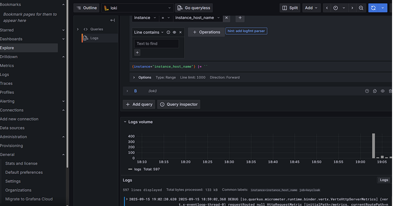
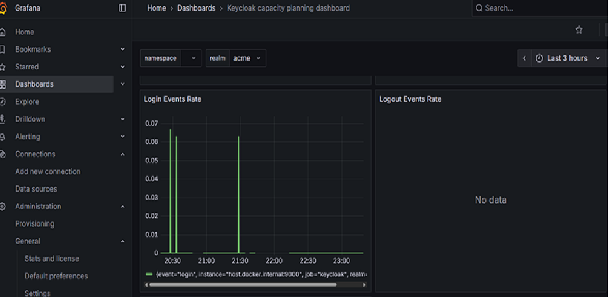
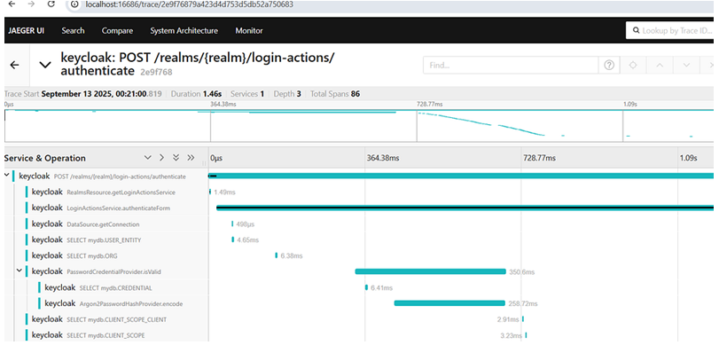
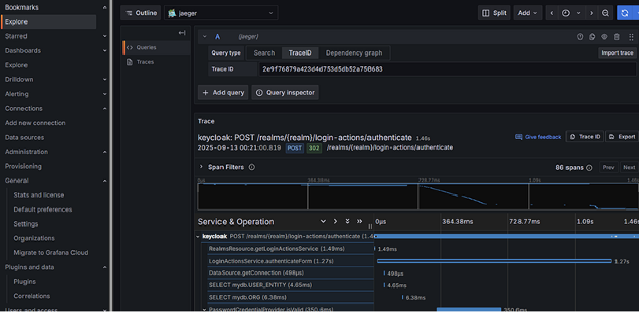

Keycloak is a critical component in many Identity and Access Management (IAM) deployments. Monitoring its health and performance is essential to ensure reliability, quickly diagnose issues, and proactively respond to anomalies.

Starting with **Keycloak 26.2**, observability has become significantly easier. Keycloak now provides built-in support for collecting **logs**, **metrics**, and **distributed traces**, making it straightforward to integrate with modern observability platforms such as **Grafana**, **Prometheus**, **Loki**, and **Jaeger**.

In production environments, multiple Keycloak instances typically run behind a load balancer for high availability. This raises an important question:

> How do we collect logs, metrics, and traces from every Keycloak instance and visualize them through a unified dashboard?

This article demonstrates one approach using Grafana and the LGTM (Loki, Grafana, Tempo/Jaeger, Prometheus) ecosystem.

---

# Prerequisites

This article covers the installation and configuration of the following components:

| Component | Purpose |
|-----------|---------|
| Promtail | Collect Keycloak logs |
| Loki | Store and index logs |
| Prometheus | Collect metrics |
| Jaeger All-In-One | Collect distributed traces (development setup) |
| Grafana | Visualize logs, metrics, and traces |

In this article:

- Keycloak runs as a **bare-metal installation** on Windows.
- All monitoring components run as **Docker containers**.
- The same concepts apply to production deployments on AWS EC2, ECS, or Kubernetes (EKS).

---

# Architecture Overview

```
                   +----------------------+
                   |      Grafana         |
                   +----------+-----------+
                              |
         +--------------------+--------------------+
         |                    |                    |
         |                    |                    |
    Prometheus             Loki               Jaeger
         ^                    ^                    ^
         |                    |                    |
         |                 Promtail                |
         +--------------------+--------------------+
                              |
                       Keycloak Server
```

---

# Log Collection

## Why Logs Matter

Logs provide detailed runtime information about Keycloak.

In environments where multiple Keycloak instances are running, centralizing logs makes troubleshooting significantly easier.

---

## Create a Docker Network

```bash
docker network create monitoring
```

---

## Run Loki

```bash
docker run -d \
  --name loki \
  --network monitoring \
  -p 3100:3100 \
  grafana/loki:2.8.2
```

---

## Configure Promtail

Create a file named **promtail-config.yml**.

```yaml
server:
  http_listen_port: 9080
  grpc_listen_port: 0

positions:
  filename: /tmp/positions.yaml

clients:
  - url: http://loki:3100/loki/api/v1/push

scrape_configs:
  - job_name: keycloak-logs
    static_configs:
      - targets:
          - localhost
        labels:
          job: keycloak
          instance: instance_host_name
          __path__: /var/log/keycloak/*.log
```

Notice the label:

```yaml
instance: instance_host_name
```

This allows Grafana to filter logs by Keycloak instance, which becomes especially useful in clustered deployments.

---

## Run Promtail

```bash
docker run -d \
  --name promtail \
  --network monitoring \
  -v C:\keycloak-26.2.5\data\log:/var/log/keycloak \
  -v C:\Projects\kc-metrics\promtail-config.yml:/etc/promtail/config.yml \
  grafana/promtail:2.8.2 \
  -config.file=/etc/promtail/config.yml
```

---

## Run Grafana

Create a Docker Compose file.

```yaml
services:
  grafana:
    image: grafana/grafana:latest
    container_name: grafana

    ports:
      - "3000:3000"

    networks:
      - monitoring

networks:
  monitoring:
    external: true
```

Start Grafana.

```bash
docker compose -f docker-compose-grafana.yml up -d
```

After adding Loki as a data source, you can filter Keycloak logs using the `instance` label.


<!-- IMAGE PLACEHOLDER: Grafana log view filtered by Keycloak instance.Diagram -->


> **Screenshot:** Grafana log view filtered by Keycloak instance.

---

# Metrics Collection

## Why Metrics Matter

Metrics provide quantitative information about Keycloak's health and performance.

Examples include:

- HTTP request counts
- Login activity
- Token issuance
- Cache statistics
- Response times

Keycloak exposes metrics at:

```
http://localhost:9000/metrics
```

Prometheus periodically scrapes this endpoint, and Grafana visualizes the collected metrics.

---

## Enable Metrics in Keycloak

Start Keycloak with metrics enabled.

```bash
kc.bat start ^
  --metrics-enabled=true ^
  --event-metrics-user-enabled=true ^
  --event-metrics-user-tags="realm,clientId" ^
  --event-metrics-user-events="login,logout,refresh_token" ^
  --http-metrics-histograms-enabled=true ^
  --cache-metrics-histograms-enabled=true ^
  --http-metrics-slos=250
```

> **Security Note:** Do not expose the metrics endpoint directly to the public Internet.

---

## Configure Prometheus

Create **prometheus.yml**.

```yaml
global:
  scrape_interval: 15s

scrape_configs:
  - job_name: keycloak

    static_configs:
      - targets:
          - host.docker.internal:9000
```

Since Keycloak is running directly on Windows while Prometheus runs inside Docker, `host.docker.internal` allows the container to access the host machine.

---

## Run Prometheus

```yaml
services:
  prometheus:
    image: prom/prometheus:latest

    container_name: prometheus

    ports:
      - "9090:9090"

    volumes:
      - ./prometheus.yml:/etc/prometheus/prometheus.yml

    networks:
      - monitoring

networks:
  monitoring:
    external: true
```

Start Prometheus.

```bash
docker compose -f docker-compose-prometheus.yml up -d
```

---

# Import Keycloak Dashboards

Clone the official Keycloak Grafana dashboards.

```bash
git clone -b main https://github.com/keycloak/keycloak-grafana-dashboard.git
```

Import a dashboard into Grafana:

1. Open **Dashboards → Import**
2. Select one of the dashboard JSON files.
3. Choose Prometheus as the data source.
4. Import the dashboard.

During testing, the **keycloak-capacity-planning-dashboard** worked well in a bare-metal setup.

<!-- IMAGE PLACEHOLDER: Keycloak Capacity Planning Dashboard-->


> **Screenshot:** Keycloak Capacity Planning Dashboard.

---

# Distributed Tracing

## Why Tracing Matters

Logs explain **what happened**.

Metrics show **how often it happens**.

Tracing explains **why it happened** by following an individual request across multiple services.

Grafana also supports **Exemplars**, allowing metrics to link directly to traces.

---

## Enable Tracing

Start Keycloak with tracing enabled.

```bash
kc.bat start --tracing-enabled=true
```

---

## Run Jaeger

```bash
docker run \
  --name jaeger \
  --network monitoring \
  -p 16686:16686 \
  -p 4317:4317 \
  -p 4318:4318 \
  jaegertracing/all-in-one
```

The Jaeger UI becomes available at:

```
http://localhost:16686
```

<!-- IMAGE PLACEHOLDER: Jaeger Tracer Explorer-->


> **Screenshot:** Jaeger Trace Explorer.

---

## Configure Grafana

Add Jaeger as a Grafana data source.

```
http://jaeger:16686
```

Use **Grafana Explore** to browse traces generated by Keycloak.

<!-- IMAGE PLACEHOLDER: Viewing traces from Grafana Explore-->


> **Screenshot:** Viewing traces from Grafana Explore.

---

# Production Considerations

For production deployments:

- Run multiple Keycloak instances behind a load balancer.
- Assign a unique instance label to each server.
- Secure all metrics endpoints.
- Configure retention policies for Loki, Prometheus, and Jaeger.
- Enable backups for observability data.
- Configure Grafana and Prometheus alerting to notify administrators of abnormal conditions.

---

# Conclusion

Keycloak's observability capabilities introduced in recent releases make monitoring significantly easier.

Using:

- **Promtail** for log collection
- **Loki** for centralized log storage
- **Prometheus** for metrics
- **Jaeger** for distributed tracing
- **Grafana** for visualization

you can build a comprehensive monitoring solution that provides complete visibility into your Keycloak deployment.

In production environments, correlating logs, metrics, and traces greatly simplifies troubleshooting and helps identify performance bottlenecks before they impact users.

## Further Reading

- Keycloak Observability Guide
- Keycloak Metrics Guide
- Grafana Documentation
- Prometheus Documentation
- OpenTelemetry Documentation